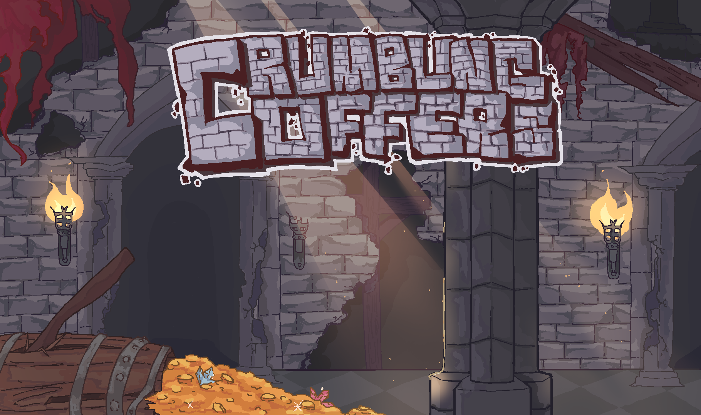
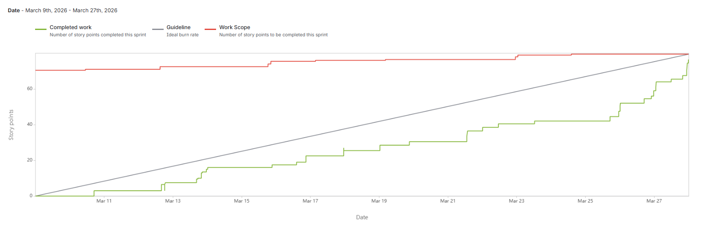
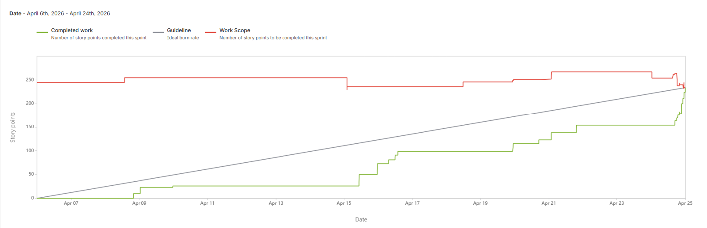

# Crumbling Coffers  

---

## Table of Contents
* [Description](#description)
* [General Info](#general-information)
* [Technologies Used](#technologies-used)
* [Sprint 1](#sprint-1)
* [Sprint 2](#sprint-2)
* [Sprint 3](#sprint-3)
* [Screenshots](#screenshots)

---

## Description

**Team:** Aurora Blakely, Andrea Gomez, Daniel Pelley, Nicholas Krustchinsky, Vadym Tovkach  

**Concept:** A competitive multiplayer Metroidvania-style platformer centered around nonlinear exploration, strategic item collection, and time-based scoring. Players navigate interconnected levels filled with movement challenges, hidden paths, and unlockable abilities that expand traversal options as the match progresses. Each session emphasizes speed, routing efficiency, and smart decision-making, rewarding players not just for collecting items, but for optimizing their path and adapting to opponents in real time. The result is a fast-paced experience that blends precision platforming with competitive depth and replayability.  

**Audience:** Fans of metroidvania platformers and pixel art who enjoy competitive and fun video games.  

**Purpose:** To create a competitive and visually engaging game for friends  

---

## General Information

**Crumbling Coffers** is a multiplayer platformer inspired by Metroidvania design principles.

The game features a large vertically explorable map filled with caves and interconnected areas. Players can traverse upward and downward freely, discovering items scattered across the environment.

The core objective is competitive collection:
- Up to **4 active players** compete within the same map.
- Items have different **rarity tiers** and **score values**.
- Matches are **time-based**.
- After time expires, a **scoreboard** displays all collected items and calculates each player's total score.

The game also includes temporary **boost items (spells)** that enhance abilities such as stamina, speed, and jump height, adding strategic depth to exploration and competition.

--- 

## Technologies Used

- **Godot Engine** – Rendering, physics, scene management, and cross-platform support.
- **GDScript (Client)** – Gameplay logic, input handling, UI, client-side prediction and interpolation.
- **C (Dedicated Server)** – Authoritative server handling networking, simulation ticks, session management, and state synchronization.
- **SQLite** – Embedded database for storing player accounts, statistics, progression, and leaderboard data.
 
---

### Sprint 1

### Contributions

**Aurora**: "Added assets for player and level scenes as well as laid out the level, added collision to interactable ground, and added a player camera."  

- `Jira Task: Learn TileMap and create a basic map level`  
    - [PROJ-28](https://cs3398-callisto-s26.atlassian.net/browse/PROJ-28), [Bitbucket](https://bitbucket.org/cs3398-callisto-s26/crumbling-coffers-main/commits/branch/PROJ-28-Learn-Tilemap)  
- `Jira Task: Agree on Base Game`  
    - [PROJ-68](https://cs3398-callisto-s26.atlassian.net/browse/PROJ-68). [Bitbucket](https://bitbucket.org/cs3398-callisto-s26/crumbling-coffers-main/commits/branch/PROJ-68-BASE-GAME)  
- `Jira Task: Level Architecture & Collision Design`  
    - [PROJ-33](https://cs3398-callisto-s26.atlassian.net/browse/PROJ-33), [Bitbucket](https://bitbucket.org/cs3398-callisto-s26/crumbling-coffers-main/commits/branch/feature/PROJ-33-collision)  
- `Jira Task: Player Spawning & Camera Integration`  
    - [PROJ-35](https://cs3398-callisto-s26.atlassian.net/browse/PROJ-35), [Bitbucket](https://bitbucket.org/cs3398-callisto-s26/crumbling-coffers-main/commits/branch/PROJ-35-player-camera)  
- `Jira Task: Interactive Item & Platform Placement`  
    - [PROJ-36](https://cs3398-callisto-s26.atlassian.net/browse/PROJ-36), [Bitbucket](https://bitbucket.org/cs3398-callisto-s26/crumbling-coffers-main/commits/branch/PROJ-36-item-platforms)  

**Andrea**: "incorporated an unrefined inheritance framework for how item classes will be created, and wrote tests testing initial character movment collisions." 

- `Jira Task: Learn Node System & Scene Composition`  
    - [PROJ-47](https://cs3398-callisto-s26.atlassian.net/browse/PROJ-47), [Bitbucket](https://bitbucket.org/cs3398-callisto-s26/crumbling-coffers-main/commits/branch/PROJ-47-learn-node-system-scene-composit)  
- `Jira Task: Learn Timers, Autoloads & Basic Game State Management`  
    - [PROJ-52](https://cs3398-callisto-s26.atlassian.net/browse/PROJ-52), [Bitbucket](http://bitbucket.org/cs3398-callisto-s26/crumbling-coffers-main/commits/branch/PROJ-52-learn-timers-autoloads-basic-gam)  
- `Jira Task: Define classes for different items and classifications`  
    - [PROJ-40](https://cs3398-callisto-s26.atlassian.net/browse/PROJ-40), [Bitbucket](https://bitbucket.org/cs3398-callisto-s26/crumbling-coffers-main/commits/branch/feature/PROJ-40-defining-abstract-item-objects)  
- `Jira Task: Testing Collisions`  
    - [PROJ-65](https://cs3398-callisto-s26.atlassian.net/browse/PROJ-65), [Bitbucket](https://bitbucket.org/cs3398-callisto-s26/crumbling-coffers-main/commits/branch/PROJ-65-testing-collisions)  

**Daniel Pelley**: "Added a basic item and system that allows the player to pick up items along with the framework for the player's inventory/backpack."

- `Jira Task: Learning GDScript and GoDot`
    - [PROJ-29](https://cs3398-callisto-s26.atlassian.net/browse/PROJ-29), [Bitbucket](https://bitbucket.org/cs3398-callisto-s26/crumbling-coffers-main/commits/branch/PROJ-29-learning-gdscript)
- `Jira Task: Learn Event System & Signals Through Item Collection`
    - [PROJ-48](https://cs3398-callisto-s26.atlassian.net/browse/PROJ-48), [Bitbucket](https://bitbucket.org/cs3398-callisto-s26/crumbling-coffers-main/commits/branch/PROJ-48-learn-event-system-signals-throu)
- `Jira Task: Design: Ability Item System Spec`
    - [PROJ-21](https://cs3398-callisto-s26.atlassian.net/browse/PROJ-21), [Bitbucket](https://bitbucket.org/cs3398-callisto-s26/crumbling-coffers-main/commits/branch/PROJ-21-design-ability-item-system-spec)
 - `Jira Task: Implementation Item Inventory (Client, Godot/GDScript)`
    - [PROJ-25](https://cs3398-callisto-s26.atlassian.net/browse/PROJ-25), [Bitbucket](https://bitbucket.org/cs3398-callisto-s26/crumbling-coffers-main/commits/branch/PROJ-25-implementation-client-godot-gdsc)
 
**Nicholas**: "added a player-character that users can move with keyboard input, and related tests."

- `Jira Task: learn godot movement + collision ideas`
    - [PROJ-66](https://cs3398-callisto-s26.atlassian.net/browse/PROJ-66), [Bitbucket](https://bitbucket.org/cs3398-callisto-s26/crumbling-coffers-main/commits/branch/PROJ-66-learn-godot-movement-collision-i)
- `Jira Task: Player horizontal movement rules`
    - [PROJ-51](https://cs3398-callisto-s26.atlassian.net/browse/PROJ-51), [Bitbucket](https://bitbucket.org/cs3398-callisto-s26/crumbling-coffers-main/commits/branch/feature/PROJ-51-player-horizontal-movement-rules)
- `Jira Task: Player vertical movement rules`
    - [PROJ-55](https://cs3398-callisto-s26.atlassian.net/browse/PROJ-55), [Bitbucket](https://bitbucket.org/cs3398-callisto-s26/crumbling-coffers-main/commits/branch/feature/PROJ-55-player-vertical-movement-rules)
- `Jira Task: Player moves with keypresses`
    - [PROJ-63](https://cs3398-callisto-s26.atlassian.net/browse/PROJ-63), [Bitbucket](https://bitbucket.org/cs3398-callisto-s26/crumbling-coffers-main/commits/branch/feature/PROJ-63-player-moves-with-keypresses)
- `Jira Task: Testing Movement System`
    - [PROJ-64](https://cs3398-callisto-s26.atlassian.net/browse/PROJ-64), [Bitbucket](https://bitbucket.org/cs3398-callisto-s26/crumbling-coffers-main/commits/branch/PROJ-64-testing-movement-system)  

**Vadym**: created the initial version of the server and established the core infrastructure and foundation for the backend.

- `Jira Task: Design the server architecture and produce a corresponding system diagram outlining core components and their interactinos.`
    - PROJ-17, [Bitbucket](https://bitbucket.org/cs3398-callisto-s26/crumbling-coffers-main/commits/branch/feature/PROJ-17-design-the-server-architecture-a)
- `Jira Task: Initial Server Setup`
    - PROJ-24, [Bitbucket](https://bitbucket.org/cs3398-callisto-s26/crumbling-coffers-main/commits/branch/PROJ-24-initial-server-setup)
- `Jira Task: Explore Godot Engine and GDSCRIPT`
    - PROJ-49, [Bitbucket](https://bitbucket.org/cs3398-callisto-s26/crumbling-coffers-main/commits/branch/PROJ-49-explore-godot-engine-and-gdscript)
- `Jira Task: Set up Orchestrator Process`
    - PROJ-41, [Bitbucket](https://bitbucket.org/cs3398-callisto-s26/crumbling-coffers-main/commits/branch/PROJ-41-set-up-orchestrator-process)
- `Jira Task: Finish Supervisor Process`
    - PROJ-30, [Bitbucket](https://bitbucket.org/cs3398-callisto-s26/crumbling-coffers-main/commits/branch/PROJ-30-finish-supervisor-process)
- `Jira Task: Setup Game Server Process`
    - PROJ-32, [Bitbucket](https://bitbucket.org/cs3398-callisto-s26/crumbling-coffers-main/commits/branch/PROJ-32-setup-game-server-process)
- `Jira Task: Finish integrate of epoll into the child game process network thread.`
    - PROJ-75, [Bitbucket](https://bitbucket.org/cs3398-callisto-s26/crumbling-coffers-main/commits/branch/PROJ-75-create-a-dedicated-network-thread-structure)
- `Jira Task: Create a dedicated network thread context structure.`
    - PROJ-74, [Bitbucket](https://bitbucket.org/cs3398-callisto-s26/crumbling-coffers-main/commits/branch/PROJ-74-finish-integrate-of-epoll)

- `Sprint Work`
    - Contributed 200+ commits during Sprint 1.
    - Implemented basic server communication.
    - Built the foundation and overall skeleton of the server infrastructure.

- `Next Steps`
    - Continue building on the existing foundation and expand the server functionality.
    
### Reports

### Next Steps

**Aurora:**

- Finish fully spanning first map design
- Test map against player mechanics to ensure playability
- Order foreground/background layers for non/interactive parts of scene

**Andrea:**

- Refine item inventory and score UI design (HUD, "head-up display")
- Global match timer UI and game timer (for singleplayer)
- Implement simple "end-of-match" redirection and score tally page

**Daniel:**

- Adding functional items that affect the player in various ways. 
- Adding to the player the ability to use the items. 
 
**Nicholas:**

- Make player-character movement feel more satisfying with multiple iterations of refinement.
- Add visual hints at the edge of the player's screen to inform them of items barely out of view.
- Refine some of my older code for scalability, IF we decide it's needed for certain features to exist.

**Vadym:**

- For the server, the next goal is to implement matchmaking and meaningful communication between the client and the server.
    - Finish the orchestrator process.
    - Add a game loop to the game processes.
    - Implement port management on the orchestrator side.

- Design and implement a network module on the client side.

#### Completed Features (in Sprint 1)
- Learning Godot Engine  
- Leaning GDScript  
- Map Design & Interactivity  
- Large vertically and horizontally explorable map   
- Item system with rarity tiers and score values  

---

### Sprint 2

### Contributions

**Aurora**: "Implemented the end-to-end gameplay flow, including scene transitions for single-player mode, match-end triggers, and score page redirection. Also developed the first custom map assets and performed a visual polish pass on the environment and interactive elements."  

- `Jira Task: Interactive Item & Platform Placement`  
    - [PROJ-36](https://cs3398-callisto-s26.atlassian.net/browse/PROJ-36), [Bitbucket](https://bitbucket.org/cs3398-callisto-s26/crumbling-coffers-main/commits/branch/PROJ-36-item-platforms)  
- `Jira Task: Visual Contrast & Accessibility Pass`  
    - [PROJ-37](https://cs3398-callisto-s26.atlassian.net/browse/PROJ-37). [Bitbucket](https://bitbucket.org/cs3398-callisto-s26/crumbling-coffers-main/commits/branch/PROJ-37-visual-accessibility)  
- `Jira Task: Navigation & Interaction Unit Testing`  
    - [PROJ-38](https://cs3398-callisto-s26.atlassian.net/browse/PROJ-38), [Bitbucket](https://bitbucket.org/cs3398-callisto-s26/crumbling-coffers-main/commits/branch/PROJ-38-navigation-test)  
- `Jira Task: Transition Logic: Menu to Match Start`  
    - [PROJ-44](https://cs3398-callisto-s26.atlassian.net/browse/PROJ-44), [Bitbucket](https://bitbucket.org/cs3398-callisto-s26/crumbling-coffers-main/commits/branch/PROJ-44-mm-2-match-start)  
- `Jira Task: End-of-Match Trigger & Score Page Redirection`  
    - [PROJ-45](https://cs3398-callisto-s26.atlassian.net/browse/PROJ-45), [Bitbucket](https://bitbucket.org/cs3398-callisto-s26/crumbling-coffers-main/commits/branch/PROJ-45-end-score-transition)  
- `Jira Task: Create 1st Custom Map Design Aspects`  
    - [PROJ-53](https://cs3398-callisto-s26.atlassian.net/browse/PROJ-53), [Bitbucket](https://bitbucket.org/cs3398-callisto-s26/crumbling-coffers-main/commits/branch/PROJ-53-1st-map-aspects)  
- `Jira Task: Main Menu to Single-Player Scene Transition`  
    - [PROJ-90](https://cs3398-callisto-s26.atlassian.net/browse/PROJ-90), [Bitbucket](https://bitbucket.org/cs3398-callisto-s26/crumbling-coffers-main/commits/branch/PROJ-90-mm-2-training-ground)  

**Andrea**: "Created simple main menu page, worked on implementation of inventory for collectible score items and hotbar for consumable items. Also implemented match state manager, added to the HUD UI, and created custom font asset to make game distinctive." 

- `Jira Task: Main Menu Page Framework` 
    - PROJ-83, [Bitbucket](https://bitbucket.org/cs3398-callisto-s26/crumbling-coffers-main/commits/branch/PROJ-83-main-menu-page-framework)  
- `Jira Task: Main Inventory Framework`
    - PROJ-106, [Bitbucket](http://bitbucket.org/cs3398-callisto-s26/crumbling-coffers-main/commits/branch/PROJ-106-main-inventory-framework)  
- `Jira Task: Sub Inventory Framework`  
    - PROJ-105, [Bitbucket](https://bitbucket.org/cs3398-callisto-s26/crumbling-coffers-main/commits/branch/PROJ-105-sub-inventory-framework)  
- `Jira Task: Global Match State Manager`  
    - PROJ-43, [Bitbucket](https://bitbucket.org/cs3398-callisto-s26/crumbling-coffers-main/commits/branch/PROJ-43-global-match-state-manager)
- `Jira Task: Match Timer UI Design & HUD Integration`
    - PROJ-42, [Bitbucket](https://bitbucket.org/cs3398-callisto-s26/crumbling-coffers-main/commits/branch/PROJ-42-match-timer-ui-design-hud-integr) 
- `Jira Task: UI Visual Integration (Score & Timer Display Styling)`
    - PROJ-61, [Bitbucket](https://bitbucket.org/cs3398-callisto-s26/crumbling-coffers-main/commits/branch/PROJ-61-score-and-timer-ui-visual-integration)

**Daniel Pelley**: "Added various items for players to use against each other, a test dummy to test items and other various aspects, and random spawning for items around the map."

- `Jira Task: Create Test Dummy for Item Effects`
    - [PROJ-107](https://cs3398-callisto-s26.atlassian.net/browse/PROJ-107), [Bitbucket](https://bitbucket.org/cs3398-callisto-s26/crumbling-coffers-main/commits/branch/PROJ-107-create-test-dummy-for-item-effe)
- `Jira Task: Implement Random Item Spawning`
    - [PROJ-112](https://cs3398-callisto-s26.atlassian.net/browse/PROJ-112), [Bitbucket](https://bitbucket.org/cs3398-callisto-s26/crumbling-coffers-main/commits/branch/PROJ-112-implement-random-item-spawning)
- `Jira Task: Create Freezing Staff`
    - [PROJ-111](https://cs3398-callisto-s26.atlassian.net/browse/PROJ-111), [Bitbucket](https://bitbucket.org/cs3398-callisto-s26/crumbling-coffers-main/commits/branch/PROJ-111-freezing-staff)
 - `Jira Task: Create Slow Staff`
    - [PROJ-110](https://cs3398-callisto-s26.atlassian.net/browse/PROJ-110), [Bitbucket](https://bitbucket.org/cs3398-callisto-s26/crumbling-coffers-main/commits/branch/PROJ-110-slow-staff)
 - `Jira Task: Create Disorientation Staff`
    - [PROJ-109](https://cs3398-callisto-s26.atlassian.net/browse/PROJ-109), [Bitbucket](https://bitbucket.org/cs3398-callisto-s26/crumbling-coffers-main/commits/branch/PROJ-109-disorientation-orb)
 
    
 
**Nicholas**: "Refined player movement and added screen hints for items out of view"

- `Jira Task: first iteration movement tuning`
    - [PROJ-86](https://cs3398-callisto-s26.atlassian.net/browse/PROJ-86), [Bitbucket](https://bitbucket.org/cs3398-callisto-s26/crumbling-coffers-main/commits/branch/PROJ-86-first-iteration-movement-tuning)
- `Jira Task: Add constant default variables for player's movement`
    - [PROJ-79](https://cs3398-callisto-s26.atlassian.net/browse/PROJ-79), [Bitbucket](https://bitbucket.org/cs3398-callisto-s26/crumbling-coffers-main/commits/branch/feature%2FPROJ-79-add-constant-default-variables-f)
- `Jira Task: Add a direction-inverting multiplier to player`
    - [PROJ-84](https://cs3398-callisto-s26.atlassian.net/browse/PROJ-84), [Bitbucket](https://bitbucket.org/cs3398-callisto-s26/crumbling-coffers-main/commits/branch/feature%2FPROJ-84-add-a-direction-inverting-multip)
- `Jira Task: Add State Machine for tracking player's state`
    - [PROJ-80](https://cs3398-callisto-s26.atlassian.net/browse/PROJ-80), [Bitbucket](https://bitbucket.org/cs3398-callisto-s26/crumbling-coffers-main/commits/branch/feature%2FPROJ-80-add-state-machine-for-tracking-p)
- `Jira Task: Add (more) player mechanics`
    - [PROJ-81](https://cs3398-callisto-s26.atlassian.net/browse/PROJ-81), [Bitbucket](https://bitbucket.org/cs3398-callisto-s26/crumbling-coffers-main/commits/branch/feature%2FPROJ-81-add-more-player-mechanics)
- `Jira Task: Off-screen indicator design`
    - [PROJ-27](https://cs3398-callisto-s26.atlassian.net/browse/PROJ-27), [Bitbucket](https://bitbucket.org/cs3398-callisto-s26/crumbling-coffers-main/commits/branch/feature%2FPROJ-27-off-screen-indicator-design)
- `Jira Task: Off-screen indicator spawning + spawnconditions`
    - [PROJ-39](https://cs3398-callisto-s26.atlassian.net/browse/PROJ-39), [Bitbucket](https://bitbucket.org/cs3398-callisto-s26/crumbling-coffers-main/commits/branch/feature%2FPROJ-39-off-screen-indicator-spawning-sp)
- `Jira Task: Off-screen indicator position on screen`
    - [PROJ-31](https://cs3398-callisto-s26.atlassian.net/browse/PROJ-31), [Bitbucket](https://bitbucket.org/cs3398-callisto-s26/crumbling-coffers-main/commits/branch/feature%2FPROJ-31-off-screen-indicator-position-on)
- `Jira Task: Add missing player state transitions `
    - [PROJ-116](https://cs3398-callisto-s26.atlassian.net/browse/PROJ-116), [Bitbucket](https://bitbucket.org/cs3398-callisto-s26/crumbling-coffers-main/commits/branch/PROJ-116-add-missing-player-state-transi)

**Vadym**: implemented core networking, matchmaking, and process management systems for the game server, enabling scalable session creation and reliable communication between components. Contributed to both client and server-side functionality, including testing, bug fixes, and integration of gameplay features.

- `Jira Task: PROJ-4 - Initialize Networking Module on Client Side` 
    - PROJ-4, [Bitbucket](https://bitbucket.org/cs3398-callisto-s26/crumbling-coffers-main/commits/branch/PROJ-4-initialize-networking-module-on-c)
- `Jira Task: PROJ-77 - Complete UDP write routine and revise udp_read in game process`
    - PROJ-77, [Bitbucket](https://bitbucket.org/cs3398-callisto-s26/crumbling-coffers-main/commits/branch/PROJ-77-complete-udp-write-routine-and-r)
- `Jira Task: PROJ-91 - Create and manage the matchmaking queue`
    - PROJ-91, [Bitbucket](https://bitbucket.org/cs3398-callisto-s26/crumbling-coffers-main/commits/branch/PROJ-91-create-and-manage-the-matchmaking)
- `Jira Task: PROJ-92 - Form sessions and notify clients`
    - PROJ-92, [Bitbucket](https://bitbucket.org/cs3398-callisto-s26/crumbling-coffers-main/commits/branch/PROJ-92-form-sessions-and-notify-clients)
- `Jira Task: PROJ-93 - Build the port pool manager`
    - PROJ-93, [Bitbucket](https://bitbucket.org/cs3398-callisto-s26/crumbling-coffers-main/commits/branch/PROJ-93-build-the-port-pool-manager)
- `Jira Task: PROJ-94 - Handle process communication and lifecycle tracking`
    - PROJ-94, [Bitbucket](https://bitbucket.org/cs3398-callisto-s26/crumbling-coffers-main/commits/branch/PROJ-94-handle-process-communication)
- `Jira Task: PROJ-95 - Reclaim ports and handle failures cleanly`
    - PROJ-95, [Bitbucket](https://bitbucket.org/cs3398-callisto-s26/crumbling-coffers-main/commits/branch/PROJ-95-reclaim-ports-and-handle-failure)
- `Jira Task: PROJ-96 - Implement multiplayer game search menu`
    - PROJ-96, [Bitbucket](https://bitbucket.org/cs3398-callisto-s26/crumbling-coffers-main/commits/branch/feature%2FPROJ-96-implement-multiplayer-game-search-menu)
- `Jira Task: PROJ-114 - Create Test for Matchmaker and Session Creation`
    - PROJ-114, [Bitbucket](https://bitbucket.org/cs3398-callisto-s26/crumbling-coffers-main/commits/branch/PROJ-114-create-test-for-matchmaker)
- `Jira Task: PROJ-115 - Fix Matchmaker Bug`
    - PROJ-115, [Bitbucket](https://bitbucket.org/cs3398-callisto-s26/crumbling-coffers-main/commits/branch/bugfix%2FPROJ-115-fix-matchmaker-bug)
- `Jira Task: PROJ-130 - Integrate server requests into lobby menu`
    - PROJ-130, [Bitbucket](https://bitbucket.org/cs3398-callisto-s26/crumbling-coffers-main/commits/branch/PROJ-130-integrate-server-requests-into-lobby-menu)

- `Sprint Work`
    - Contributed 200+ commits during Sprint 1.
    - Implemented basic server communication.
    - Built the foundation and overall skeleton of the server infrastructure.

- `Next Steps`
    - Continue building on the existing foundation and expand the server functionality.
    
### Reports

### Next Steps

**Aurora:**

- Add variety in map designs with new assets and expand map   
- Add variety in player characters with new assets   
- Polish levels and ensure compatibility with player characters   
- Playtesting   

**Andrea:**

- Fine-tune player hotbar to provide item information (info hints)
- Integrate a refined/polished main menu page and character selection page
- Add more aesthetic graphics for match making menu
- Create assets for Title/Main page
- Testing

**Daniel:**

- Tuning and touching up items
- Add spawn locations for usuable items
- Organize Code to ensure SOLID principles
- Add music while match is going. 
- Tasks above subject to change as management requires or if priorities shift.
 
**Nicholas:**

- Tuning for new movement features, finer tuning for old movement features with new states
- Consider item indicator refinements (indicator in corner? transparency? variable size?)
- Character animation improvements. AT LEAST horizontally flip character when changing directions. POSSIBLY play existing player animations based on state (...if desired)
- Add minor common platformer movement mechanics (notably "coyote time") 

**Vadym:**

- Prepare the client side for multiplayer integration.
- Implement the game process.
- Integrate multiplayer into the game.

---

### Sprint 3

### Contributions

**Aurora**: "I designed and polished a new custom map, CastleDungeon, focusing on enhanced verticality, room for multiple player spawn locations, and platforming compatibility to ensure a high-quality gameplay experience. To streamline this, I established a BaseLevel inheritance structure that centralized universal map functions, allowing for a more modular and efficient level-design workflow."  

- `Jira Task: Time-Sync & Transition Unit Testing`  
    - [PROJ-46](https://cs3398-callisto-s26.atlassian.net/browse/PROJ-46), [Bitbucket](https://bitbucket.org/cs3398-callisto-s26/crumbling-coffers-main/commits/branch/PROJ-46-time-sync-unit-testing)  
- `Jira Task: 1st Map Ready For Multiplayer`  
    - [PROJ-99](https://cs3398-callisto-s26.atlassian.net/browse/PROJ-99). [Bitbucket](https://bitbucket.org/cs3398-callisto-s26/crumbling-coffers-main/commits/branch/PROJ-99-1st-map-multiplayer-ready)  
- `Jira Task: Polish 1st Custom Map Design & Playability`  
    - [PROJ-137](https://cs3398-callisto-s26.atlassian.net/browse/PROJ-137), [Bitbucket](https://bitbucket.org/cs3398-callisto-s26/crumbling-coffers-main/commits/branch/PROJ-137-polish-1st-map)  
- `Jira Task: Testing Plan Task (Aurora)`  
    - [PROJ-170](https://cs3398-callisto-s26.atlassian.net/browse/PROJ-170), [Bitbucket](https://bitbucket.org/cs3398-callisto-s26/crumbling-coffers-main/commits/branch/PROJ-170-testing-plan-task-aurora)  
- `Jira Task: Testing Results Task (Aurora)`  
    - [PROJ-171](https://cs3398-callisto-s26.atlassian.net/browse/PROJ-171), [Bitbucket](https://bitbucket.org/cs3398-callisto-s26/crumbling-coffers-main/commits/branch/PROJ-171-testing-results-task-aurora)  

&nbsp;&nbsp;*BONUS* (post-sprint/pre-demo):

- `Jira Task: Refurbish UI/UX`  
    - [PROJ-178](https://cs3398-callisto-s26.atlassian.net/browse/PROJ-178), [Bitbucket](https://bitbucket.org/cs3398-callisto-s26/crumbling-coffers-main/commits/branch/PROJ-178-refurbish-ui-ux)  

**Andrea**: "Refurbished Main Menu page to fit aesthetic of our game as well as worked on small QOL (quality of life) changes with UI elements." 

- `Jira Task: Item Information Hint for Hotbar` 
    - PROJ-134, [Bitbucket](https://bitbucket.org/cs3398-callisto-s26/crumbling-coffers-main/commits/branch/PROJ-134-item-info-hint-for-hotbar)  
- `Jira Task: Create Main Menu Title design assets`
    - PROJ-102, [Bitbucket](https://bitbucket.org/cs3398-callisto-s26/crumbling-coffers-main/commits/branch/PROJ-102-main-menu-title-assets-creation)
- `Jira Task: Implement polished Main Menu UI`
    - PROJ-98, [Bitbucket](https://bitbucket.org/cs3398-callisto-s26/crumbling-coffers-main/commits/branch/PROJ-98-implement-polished-main-menu-ui)
- `Jira Task: Create custom assets for hotbar and inventory and edit UI`
    - PROJ-158, [Bitbucket](https://bitbucket.org/cs3398-callisto-s26/crumbling-coffers-main/commits/branch/PROJ-158-create-custom-assets-for-hotbar)
- `Jira Task: Testing Plan Task (Andrea)`
    - PROJ-174, [Bitbucket](https://bitbucket.org/cs3398-callisto-s26/crumbling-coffers-main/commits/branch/PROJ-174-testing-plan-task-andrea)
- `Jira Task: Testing Reults Task (Andrea)`
    - PROJ-175, [Bitbucket](https://bitbucket.org/cs3398-callisto-s26/crumbling-coffers-main/commits/branch/PROJ-175-testing-results-task-andrea)
- `Additional Jira Task (post-sprint/pre-demo): Character Page Implementation`
    - PROJ-179, [Bitbucket](https://bitbucket.org/cs3398-callisto-s26/crumbling-coffers-main/commits/branch/PROJ-179-character-page-implementation)

**Daniel Pelley**: "Refactor major systems to follow a more SOLID approach along with making items multiplayer ready(to be integrated)."

- `Jira Task: Refactor Status Effects (Freeze, Slow, Disorientation) into Unified System`
    - [PROJ-139](https://cs3398-callisto-s26.atlassian.net/browse/PROJ-139), [Bitbucket](https://bitbucket.org/cs3398-callisto-s26/crumbling-coffers-main/commits/branch/PROJ-139-refactor-status-effects-freeze-)
- `Jira Task: Refactor Item Pickup Flow for Maintainability and Multiplayer`
    - [PROJ-143](https://cs3398-callisto-s26.atlassian.net/browse/PROJ-143), [Bitbucket](https://bitbucket.org/cs3398-callisto-s26/crumbling-coffers-main/commits/branch/PROJ-143-refactor-item-pickup-flow-for-m)
- `Jira Task: Refactor Staff and Item Scripts to Reduce Duplication`
    - [PROJ-144](https://cs3398-callisto-s26.atlassian.net/browse/PROJ-144), [Bitbucket](https://bitbucket.org/cs3398-callisto-s26/crumbling-coffers-main/commits/branch/PROJ-144-refactor-staff-and-item-scripts)
 - `Jira Task: Refactor Inventory and Hotbar Systems for Cleaner Separation of Concerns`
    - [PROJ-145](https://cs3398-callisto-s26.atlassian.net/browse/PROJ-145), [Bitbucket](https://bitbucket.org/cs3398-callisto-s26/crumbling-coffers-main/commits/branch/PROJ-145-refactor-inventory-and-hotbar-s)
 - `Jira Task: Refactor Item Systems for Multiplayer Compatibility`
    - [PROJ-146](https://cs3398-callisto-s26.atlassian.net/browse/PROJ-146), [Bitbucket](https://bitbucket.org/cs3398-callisto-s26/crumbling-coffers-main/commits/branch/PROJ-146-refactor-item-systems-for-multi)
 

**Nicholas**: "Add animations, more (inheriting) types of players, and tweaks to indicators and movement"

- `Jira Task: second iteration movement tuning`
    - [PROJ-88](https://cs3398-callisto-s26.atlassian.net/browse/PROJ-88), [Bitbucket](https://bitbucket.org/cs3398-callisto-s26/crumbling-coffers-main/commits/branch/PROJ-88-second-iteration-movement-tuning)
- `Jira Task: Distinguish Player baseclass and controllable UserPlayer`
    - [PROJ-140](https://cs3398-callisto-s26.atlassian.net/browse/PROJ-140), [Bitbucket](https://bitbucket.org/cs3398-callisto-s26/crumbling-coffers-main/branch/PROJ-140-distinguish-player-baseclass-an)
- `Jira Task: Add RemotePlayer server-given player`
    - [PROJ-141](https://cs3398-callisto-s26.atlassian.net/browse/PROJ-141), [Bitbucket](https://bitbucket.org/cs3398-callisto-s26/crumbling-coffers-main/branch/PROJ-141-add-remoteplayer-server-given-p)
- `Jira Task: Off-screen indicators extra features`
    - [PROJ-131](https://cs3398-callisto-s26.atlassian.net/browse/PROJ-131), [Bitbucket](https://bitbucket.org/cs3398-callisto-s26/crumbling-coffers-main/branch/feature/PROJ-131-off-screen-indicators-extra-fea)
- `Jira Task: animate player by state`
    - [PROJ-138](https://cs3398-callisto-s26.atlassian.net/browse/PROJ-138), [Bitbucket](https://bitbucket.org/cs3398-callisto-s26/crumbling-coffers-main/branch/feature/PROJ-138-animate-player-by-state)
- `Jira Task: Testing Plan Task`
    - [PROJ-168](https://cs3398-callisto-s26.atlassian.net/browse/PROJ-168), [Bitbucket](https://bitbucket.org/cs3398-callisto-s26/crumbling-coffers-main/branch/PROJ-168-testing-plan-task)
- `Jira Task: Testing Results Task`
    - [PROJ-169](https://cs3398-callisto-s26.atlassian.net/browse/PROJ-169), [Bitbucket](https://bitbucket.org/cs3398-callisto-s26/crumbling-coffers-main/branch/PROJ-169-testing-results-task)

**Vadym**: "Refactored the orchestrator and implemented the server's internal game structure with a clean interface. Built packetization utilities on both the server and client sides, added a lightweight reliability layer, and moved the client networking module onto its own thread. Integrated everything through a Game class, added a multiplayer transition scene, implemented client-side interpolation, wrote and executed test plans for all three tests, and fixed window-closing and item-spawn bugs."

- `Jira Task: PROJ-167 Test Execution and Results Task (for all 3 tests)` 
    - PROJ-167, [Bitbucket](https://bitbucket.org/cs3398-callisto-s26/crumbling-coffers-main/branch/PROJ-167-test-execution-and-results-task)
- ``Jira Task: PROJ-166-testing-plan-task-for-all-3-tests`
    - PROJ-166, [Bitbucket](https://bitbucket.org/cs3398-callisto-s26/crumbling-coffers-main/branch/PROJ-166-testing-plan-task-for-all-3-tests)
- `Jira Task: PROJ-164 Implement interpolation on client side.`
    - PROJ-164, [Bitbucket](https://bitbucket.org/cs3398-callisto-s26/crumbling-coffers-main/commits/branch/PROJ-164-implement-interpolation-on-client-side)
- `Jira Task: PROJ-163 Create Multiplayer Transition Scene`
    - PROJ-163, [Bitbucket](https://bitbucket.org/cs3398-callisto-s26/crumbling-coffers-main/commits/branch/PROJ-163-create-multiplayer-transition-scene)
- `Jira Task: PROJ-160 Add the Game class to tie together netcode and client code`
    - PROJ-160, [Bitbucket](https://bitbucket.org/cs3398-callisto-s26/crumbling-coffers-main/commits/branch/PROJ-160-add-the-game-class-to-client)
- `Jira Task: PROJ-156 Implement Packetization Utility Class with Header and Payload Formation`
    - PROJ-156, [Bitbucket](https://bitbucket.org/cs3398-callisto-s26/crumbling-coffers-main/commits/branch/PROJ-156-implement-packetization-utility)
- `Jira Task: PROJ-154 Refactor Client Networking Module to Run on a Separate Thread`
    - PROJ-154, [Bitbucket](https://bitbucket.org/cs3398-callisto-s26/crumbling-coffers-main/commits/branch/PROJ-154-refactor-client-networking-module)
- `Jira Task: PROJ-153 Implement Lightweight Reliability Layer in Client Networking Module`
    - PROJ-153, [Bitbucket](https://bitbucket.org/cs3398-callisto-s26/crumbling-coffers-main/commits/branch/PROJ-156-implement-packetization-utility)
- `Jira Task: PROJ-151 Create Packetization Utility for Forming Authoritative Game-State Packets`
    - PROJ-151, [Bitbucket](https://bitbucket.org/cs3398-callisto-s26/crumbling-coffers-main/commits/branch/PROJ-151-create-packetization-utility-for-game-server) 
- `Jira Task: PROJ-150  Implement Server Internal Game Structure with Clear Interface`
    - PROJ-150, [Bitbucket](https://bitbucket.org/cs3398-callisto-s26/crumbling-coffers-main/commits/branch/PROJ-150-implement-server-internal-game-structure)
- `Jira Task: PROJ-135 Refactor Orchestrator`
    - PROJ-135, [Bitbucket](https://bitbucket.org/cs3398-callisto-s26/crumbling-coffers-main/commits/branch/PROJ-135-refactor-orchestrator)
- `Jira Task: PROJ-9991 Fix window bug`
    - PROJ-9991, [Bitbucket](https://bitbucket.org/cs3398-callisto-s26/crumbling-coffers-main/commits/branch/bugfix%2FPROJ-9991-fix-win-closing-bug)
- `Jira Task: PROJ-9992 Fix item spawn bug`
    - PROJ-9992, [Bitbucket](https://bitbucket.org/cs3398-callisto-s26/crumbling-coffers-main/commits/branch/bugfix%2Ffix-item-spawn-locations)

- `Next Steps`
    - Implement user accounts with persistent data (player stats, progression, leaderboard entries) backed by SQLite.
    - Move the server infrastructure to cloud hosting to support real remote play.
    - Integrate encryption (TLS/DTLS) into client-server communication to secure data in transit.
    
### Reports

&nbsp;
---

**User Stories:**

- Aurora: Map Design & Interactivity (creating platforms & interactable surfaces)  
- Aurora: Match Timer (start match from menu, end matches, navigate to score screen)  

- Andrea: Learning Godot Engine (navigating the engine & using assets)  
- Andrea: Asset creations (custom map tiles, character, and items)  

- Daniel: Learning GDScript (learn technologies needed such as GDScript, C, SQLite)  
- Daniel: Adding and Implementing Ability Items (item design & interactivity, player picking up & using items)  
- Daniel: As a developer, I want a test dummy so that we can easily test gameplay effects without needing multiple players.
- Daniel: As a player, I want to collect items that affect other players so that gameplay becomes more strategic. (Fixed and more accurate version of previous story)

- Nicholas: Player character movement (player character design & mechanics, player movement, navigating the map)  
- Nicholas: Off-screen visual hints (Off screen direction, reveal other players and rare items)  

- Vadym: Server foundation creation (foundational asynchronous UDP networking layer)  
- Vadym: Create the foundation for the client networking module (UDP send/receive + protocol parsing, main menu before the match starts waiting on other players)  

---

## Screenshots (Initial Vision)

---
