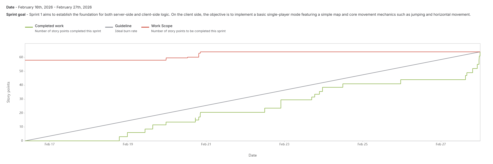

# Crumbling Coffers  

---

## Table of Contents
* [Description](#description)
* [General Info](#general-information)
* [Technologies Used](#technologies-used)
* [Features](#features)
* [Sprint 1](#sprint-1)
* [Upcoming](#upcoming)
* [Screenshots](#screenshots)

---

## Description

**Team:** Aurora Blakely, Andrea Gomez, Daniel Pelley, Nicholas Krustchinsky, Vadym Tovkach  

**Concept:** A competitive multiplayer Metroidvania-style platformer centered around nonlinear exploration, strategic item collection, and time-based scoring. Players navigate interconnected levels filled with movement challenges, hidden paths, and unlockable abilities that expand traversal options as the match progresses. Each session emphasizes speed, routing efficiency, and smart decision-making, rewarding players not just for collecting items, but for optimizing their path and adapting to opponents in real time. The result is a fast-paced experience that blends precision platforming with competitive depth and replayability.  

**Audience:** Fans of metroidvania platformers and pixel art who enjoy  

**Purpose:** To create a competitive and visually engaging game for friends  

---

## General Information

**Crumbling Coffers** is a multiplayer platformer inspired by Metroidvania design principles.

The game features a large vertically explorable map filled with caves and interconnected areas. Players can traverse upward and downward freely, discovering items scattered across the environment.

The core objective is competitive collection:
- Up to **4 active players** compete within the same map.
- Items have different **rarity tiers** and **score values**.
- Matches are **time-based**.
- After time expires, a **scoreboard** displays all collected items and calculates each player's total score.

The game also includes temporary **boost items (spells)** that enhance abilities such as stamina, speed, and jump height, adding strategic depth to exploration and competition.

--- 

## Features

### Sprint 1

### Contributions

**Nicholas**: "added a player-character that users can move with keyboard input, and related tests."

- `Jira Task: learn godot movement + collision ideas`
    - [PROJ-66](https://cs3398-callisto-s26.atlassian.net/browse/PROJ-66), [Bitbucket](https://bitbucket.org/cs3398-callisto-s26/%7Bced1f902-e50a-4f0b-8f64-5d31e5447f90%7D/branch/PROJ-66-learn-godot-movement-collision-i)
- `Jira Task: Player horizontal movement rules`
    - [PROJ-51](https://cs3398-callisto-s26.atlassian.net/browse/PROJ-51), [Bitbucket](https://bitbucket.org/cs3398-callisto-s26/%7Bced1f902-e50a-4f0b-8f64-5d31e5447f90%7D/branch/feature/PROJ-51-player-horizontal-movement-rules)
- `Jira Task: Player vertical movement rules`
    - [PROJ-55](https://cs3398-callisto-s26.atlassian.net/browse/PROJ-55), [Bitbucket](https://bitbucket.org/cs3398-callisto-s26/%7Bced1f902-e50a-4f0b-8f64-5d31e5447f90%7D/branch/feature/PROJ-55-player-vertical-movement-rules)
- `Jira Task: Player moves with keypresses`
    - [PROJ-63](https://cs3398-callisto-s26.atlassian.net/browse/PROJ-63), [Bitbucket](https://bitbucket.org/cs3398-callisto-s26/%7Bced1f902-e50a-4f0b-8f64-5d31e5447f90%7D/branch/feature/PROJ-63-player-moves-with-keypresses)
- `Jira Task: Testing Movement System`
    - [PROJ-64](https://cs3398-callisto-s26.atlassian.net/browse/PROJ-64), [Bitbucket](https://bitbucket.org/cs3398-callisto-s26/%7Bced1f902-e50a-4f0b-8f64-5d31e5447f90%7D/branch/PROJ-64-testing-movement-system)  

**Andrea**: "incorporated an unrefined inheritance framework for how item classes will be created, and wrote tests testing initial character movment collisions." 

- `Jira Task: Learn Node System & Scene Composition`  
    - [PROJ-47](https://cs3398-callisto-s26.atlassian.net/browse/PROJ-47), [Bitbucket](https://bitbucket.org/cs3398-callisto-s26/%7Bced1f902-e50a-4f0b-8f64-5d31e5447f90%7D/branch/PROJ-47-learn-node-system-scene-composit)  
- `Jira Task: Learn Timers, Autoloads & Basic Game State Management`  
    - [PROJ-52](https://cs3398-callisto-s26.atlassian.net/browse/PROJ-52), [Bitbucket](http://bitbucket.org/cs3398-callisto-s26/%7Bced1f902-e50a-4f0b-8f64-5d31e5447f90%7D/branch/PROJ-52-learn-timers-autoloads-basic-gam)  
- `Jira Task: Define classes for different items and classifications`  
    - [PROJ-40](https://cs3398-callisto-s26.atlassian.net/browse/PROJ-40), [Bitbucket](https://bitbucket.org/cs3398-callisto-s26/%7Bced1f902-e50a-4f0b-8f64-5d31e5447f90%7D/branch/feature/PROJ-40-defining-abstract-item-objects)  
- `Jira Task: Testing Collisions`  
    - [PROJ-65](https://cs3398-callisto-s26.atlassian.net/browse/PROJ-65), [Bitbucket](https://bitbucket.org/cs3398-callisto-s26/%7Bced1f902-e50a-4f0b-8f64-5d31e5447f90%7D/branch/PROJ-65-testing-collisions)  

**Daniel Pelley**: "Added a basic item and system that allows the player to pick up items along with the framework for the player's inventory/backpack."

- `Jira Task: Learning GDScript and GoDot`
    - [PROJ-29](https://cs3398-callisto-s26.atlassian.net/browse/PROJ-29), [Bitbucket](https://bitbucket.org/cs3398-callisto-s26/crumbling-coffers-main/commits/branch/PROJ-29-learning-gdscript)
- `Jira Task: Learn Event System & Signals Through Item Collection`
    - [PROJ-48](https://cs3398-callisto-s26.atlassian.net/browse/PROJ-48), [Bitbucket](https://bitbucket.org/cs3398-callisto-s26/crumbling-coffers-main/commits/branch/PROJ-48-learn-event-system-signals-throu)
- `Jira Task: Design: Ability Item System Spec`
    - [PROJ-21](https://cs3398-callisto-s26.atlassian.net/browse/PROJ-21), [Bitbucket](https://bitbucket.org/cs3398-callisto-s26/crumbling-coffers-main/commits/branch/PROJ-21-design-ability-item-system-spec)
 - `Jira Task: Design: Ability Item System Spec`
    - [PROJ-25](https://cs3398-callisto-s26.atlassian.net/browse/PROJ-25), [Bitbucket](https://bitbucket.org/cs3398-callisto-s26/crumbling-coffers-main/commits/branch/PROJ-25-implementation-client-godot-gdsc)
 
### Reports

### Next Steps

**Aurora:**

- [Plans for next steps here]

**Andrea:**

- Refine item inventory and score UI design (HUD, "head-up display")
- Global match timer UI and game timer (for singleplayer)
- Implement simple "end-of-match" redirection and score tally page

**Daniel:**

- Adding functional items that affect the player in various ways. 
- Adding to the player the ability to use the items. 
 
**Nicholas:**

- [Plans for next steps here]

**Vadym:**

- [Plans for next steps here]

[information below was from original README for features.]
&nbsp;
---
- Learning Godot Engine  
- Leaning GDScript  
- Map Design & Interactivity  
- Large vertically and horizontally explorable map   
- Item system with rarity tiers and score values  

### Upcoming
- Temporary boost items affecting player abilities 
- Timed competitive matches  
- End-of-match scoreboard with score calculation  
- Multiplayer support (planned: 4 players per match)

&nbsp;
---

**User Stories:**

- Aurora: Map Design & Interactivity (creating platforms & interactable surfaces)  
- Aurora: Match Timer (start match from menu, end matches, navigate to score screen)  

- Andrea: Learning Godot Engine (navigating the engine & using assets)  
- Andrea: Asset creations (custom map tiles, character, and items)  

- Daniel: Learning GDScript (learn technologies needed such as GDScript, C, SQLite)  
- Daniel: Adding and Implementing Ability Items (item design & interactivity, player picking up & using items)  

- Nicholas: Player character movement (player character design & mechanics, player movement, navigating the map)  
- Nicholas: Off-screen visual hints (Off screen direction, reveal other players and rare items)  

- Vadym: Server foundation creation (foundational asynchronous UDP networking layer)  
- Vadym: Create the foundation for the client networking module (UDP send/receive + protocol parsing, main menu before the match starts waiting on other players)  

- Score screen after match ends (compare scores & announce winner)  

---

## Technologies Used

- **Godot Engine** – Rendering, physics, scene management, and cross-platform support.
- **GDScript (Client)** – Gameplay logic, input handling, UI, client-side prediction and interpolation.
- **C (Dedicated Server)** – Authoritative server handling networking, simulation ticks, session management, and state synchronization.
- **SQLite** – Embedded database for storing player accounts, statistics, progression, and leaderboard data.
 
---

## Screenshots (Initial Vision)

---
